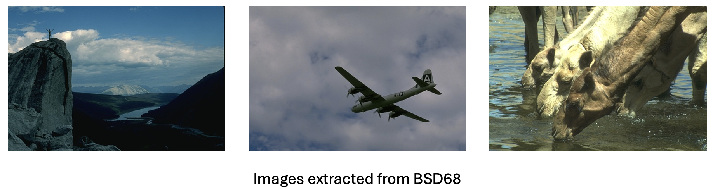
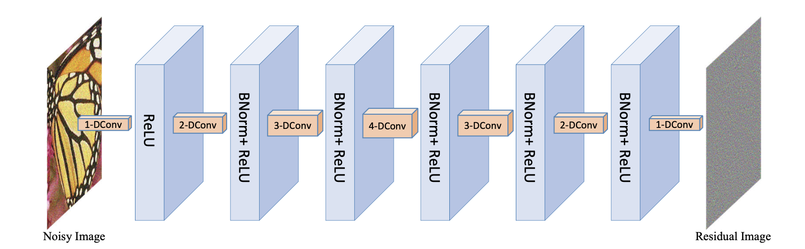
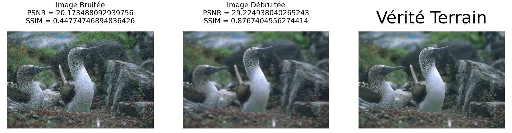
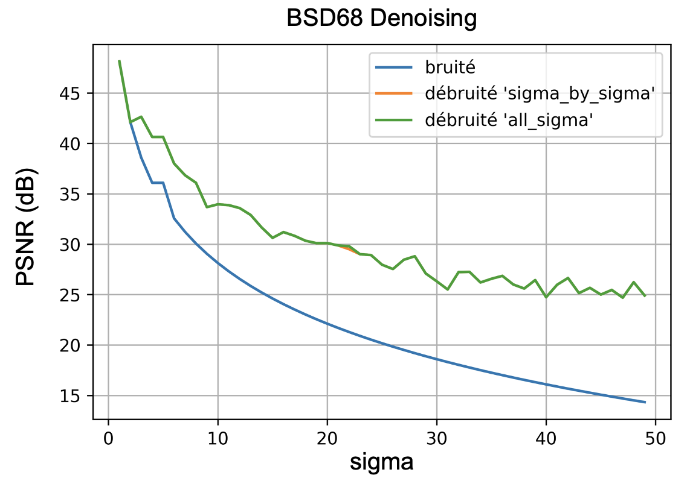
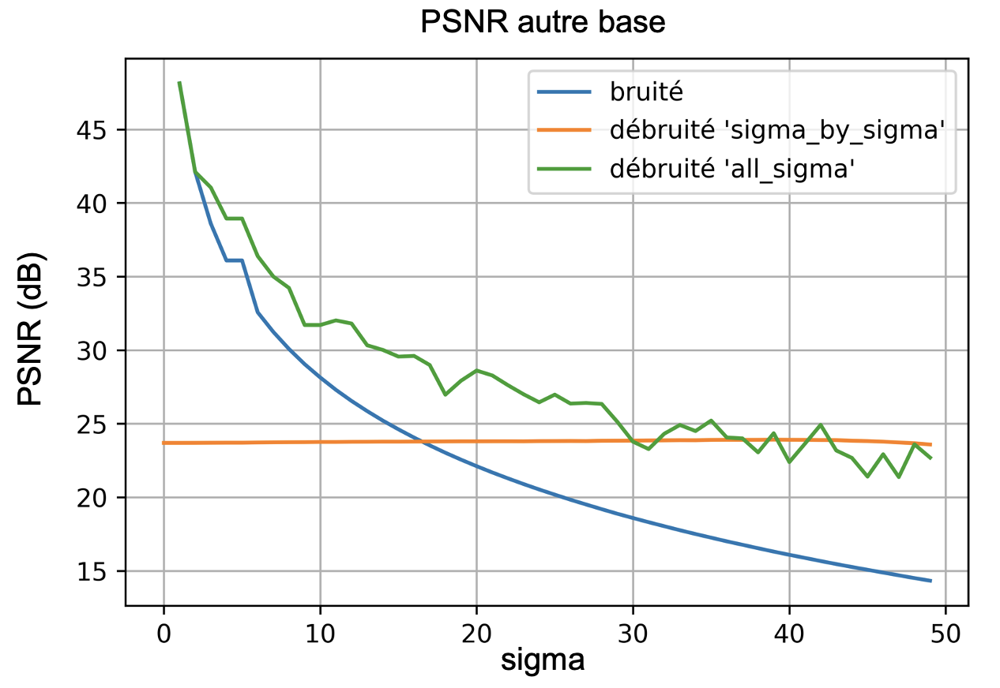

# TI-Denoising-DL
Work inspired by the articles:
1 - article 1: link
2 - article 2: link

The purpose of this work is to implement a deep-learning denoising method for Gaussian noise.

Database used:

To train our results, we use the BSD68 database comprising 68 images.

Methods used:

- We start by augmenting our database using the following transformations:

- The network we use is the following:

We choose as parameters:
- adam optimizers
- yes
- yes

- Results:

For denoising with a sigma of 25, we obtain the following results:

For other sigmas, the results obtained are as follows:

- Implementing for any database:

To use the trained network, you will need to provide the path of the photo to be denoised in the photo_application function of Model_test.py. As the noise sigma of the photo is not known, it may be necessary to train a model for the studied sigma. Just run the Model_train.py script choosing the right sigma.

- Conclusion: